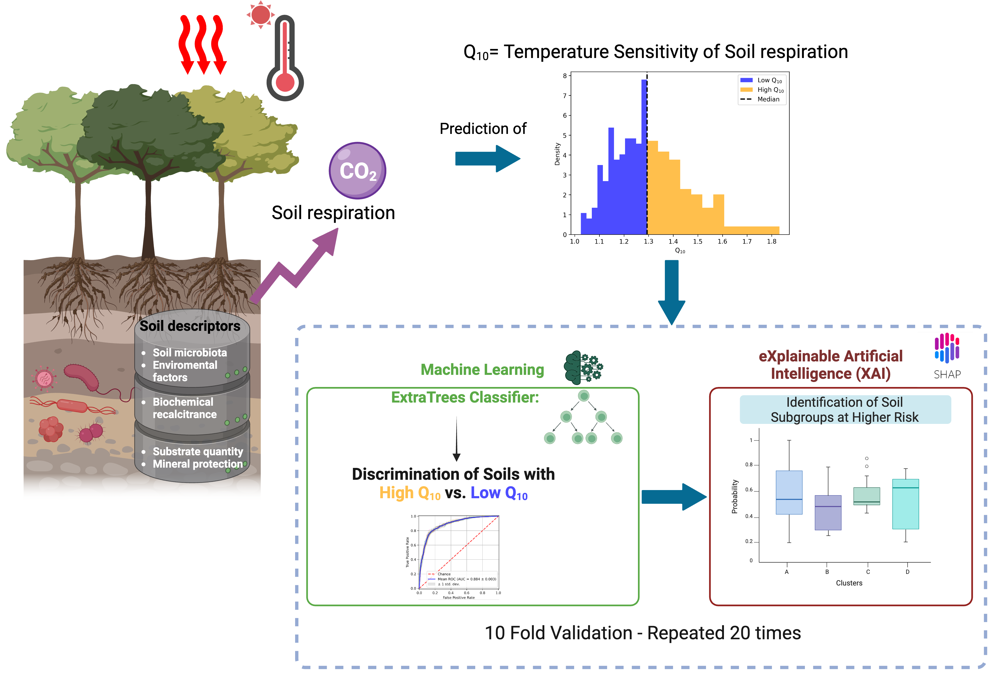

# Leveraging-Explainable-AI-to-Predict-Soil-Respiration-Sensitivity-and-Its-Drivers

# Paper
Leveraging Explainable AI to Predict Soil Respiration Sensitivity and Its Drivers: Insights for Climate Change Mitigation

# Authors:
Pierfrancesco Novielli, Michele Magarelli, Donato Romano, Pierpaolo Di Bitonto, Anna Maria Stellacci, Alfonso Monaco, Nicola Amoroso, Roberto Bellotti, Sabina Tangaro

# Graphical abstract:

# Software Requirements
The analysis has been tested on the following system:

macOS 15.2

The analysis was conducted in python.
Software versions used:

Python: 3.12.5

# Version Numbers for Python Packages in the MacOS environment

* numpy version: 1.24.3
* pandas version: 1.5.3
* matplotlib version: 3.7.2
* shap version: 0.43.0
* sklearn version: 1.2.2
* xgboost version: xgboost 2.0.2
* seaborn version: 0.12.2
* scipy version: 1.10.1
* statannotations version: 0.2.3
