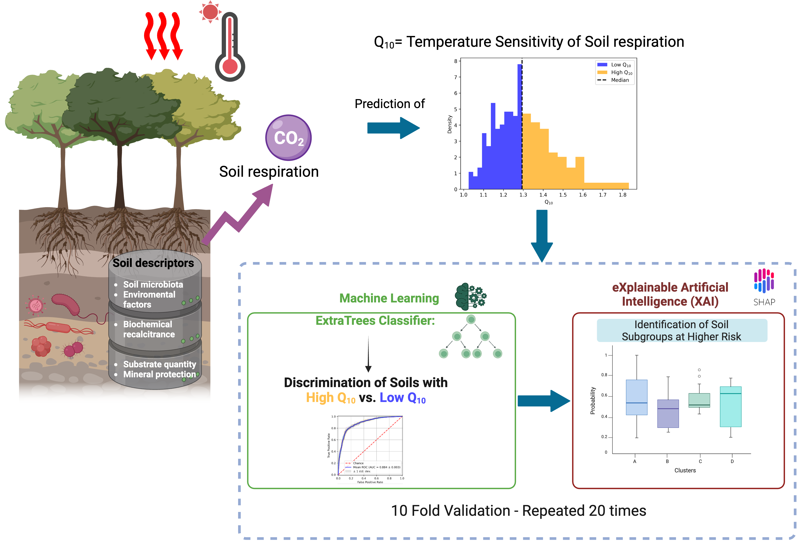

# Leveraging-Explainable-AI-to-Predict-Soil-Respiration-Sensitivity-and-Its-Drivers

# Paper
Leveraging Explainable AI to Predict Soil Respiration Sensitivity and Its Drivers: Insights for Climate Change Mitigation

# Authors:
Pierfrancesco Novielli, Michele Magarelli, Donato Romano, Pierpaolo Di Bitonto, Anna Maria Stellacci, Alfonso Monaco, Nicola Amoroso, Roberto Bellotti, Sabina Tangaro

# Graphical abstract:

